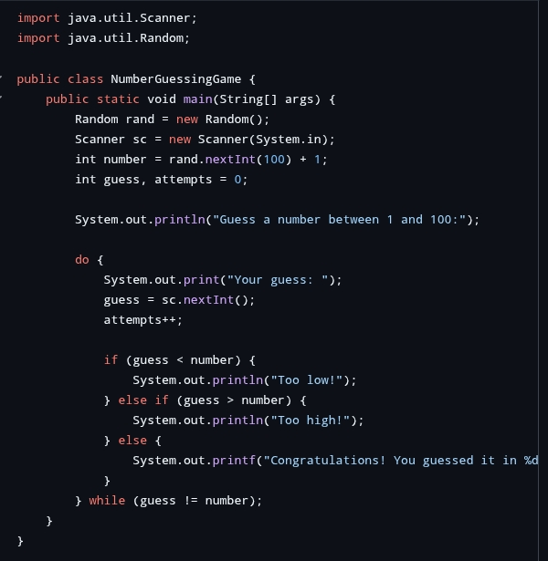
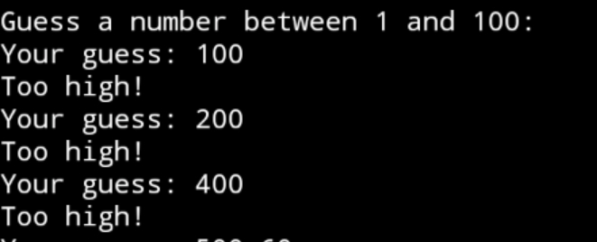

# Skillcraft-Technology-task-2
Software development internship 
# Skillcraft-Technology-task-2

## 🔧 Task Overview

This repository contains **Task 2** completed as part of my internship at **Skillcraft Technology** under the **Software Development domain**.

## 📌 Task Description

The task includes:
- Java program implementation
- String manipulation and logic practice
- Console output demonstration

## 💻 Tech Used
- Java

## 📷 Screenshots

## 🚀 Output Sample
